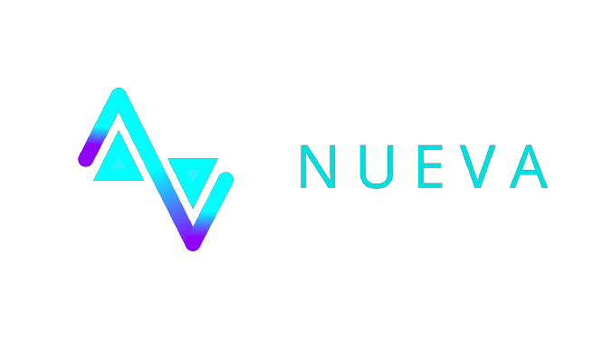

# Nueva

<div align="center" >
  

  [](https://www.npmjs.org/package/nueva)
  [](https://github.com/codingwith3dv/nueva/tree/master/LICENSE)
</div>

A reactive component based UI library used for making user interfaces. 

## Usage
- npm: 
```bash
npm install nueva
```
- yarn: 
```bash
yarn add nueva
```
- cdn: 
```html
<script src="https://unpkg.com/nueva@{latest_version}/build/nueva.js"></script>
```

## Examples
- For CDN
```javascript
class App extends nueva.Component {
  render() {
    return nueva.createElem(
      'div',
      nueva.createElem('h1', 'I am H1'),
      nueva.createElem('h2', 'I am H2')
    )
  }
}
nueva.render(nueva.createElem(new App()), document.getElementById('app'))
```
